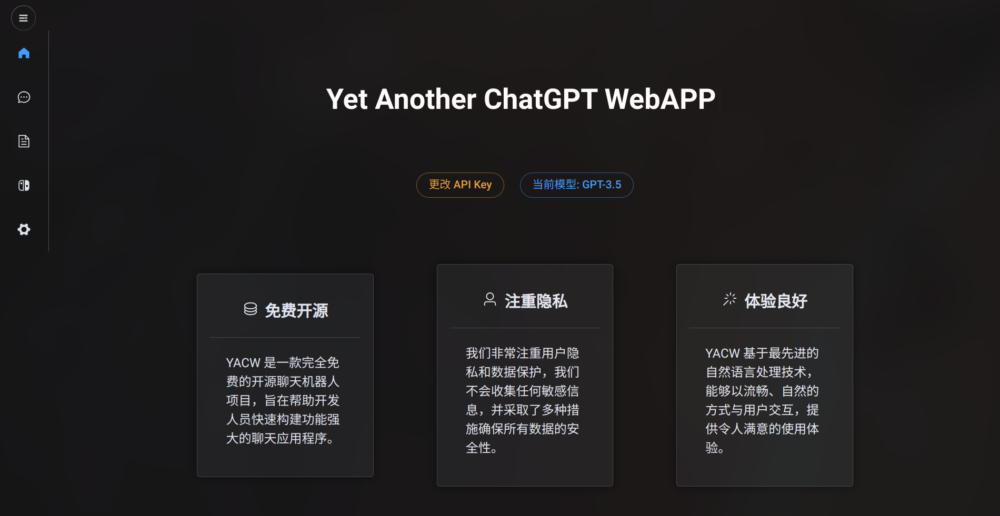

<h1 align="center">YACW Frontend</h1>
<h2 align="center">YACW 项目前端仓库</h2>

<p align="center"><a href="https://yacw.laoliu.icu">测试站点</a></p>

是的，又一个 ChatGPT 网页客户端。

由 Vue + Element-Plus 构建，前后端分离部署。

### 免费 & 开源

我们提供源代码，您可以将其部署在任何地方──服务器、电脑，甚至是您的手机上。

### 注重隐私

我们不会收集任何敏感信息，并采取了多种措施确保所有数据的安全性。

### 用户体验优先

我们希望可以为您带来最佳的 ChatGPT 使用体验。

## 自部署

### 使用 Docker Compose *推荐

前往 [yacw](https://github.com/yacw-team/yacw) 仓库。

### 使用 Docker 启动前端

```bash
docker run -d --name yacw-frontend -p 80:80 laoliu233/yacw-frontend
```

### 直接启动前端    *开发用途

```bash
# 使用 npm
npm run dev
# 使用 yarn
yarn dev
```

## 反馈

如果您在使用中有任何问题，请在 GitHub Issue 中提出。
